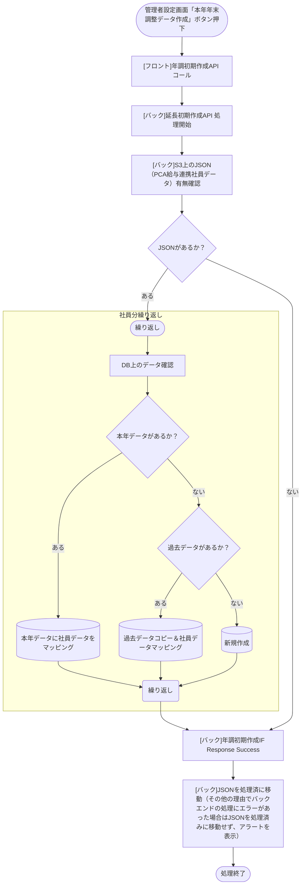

#### 本年年末調整データ作成

```mermaid
flowchart TB
  START(["管理者設定画面「本年年末調整データ作成」ボタン押下"])--> FR0["[フロント]年調初期作成API コール"]
  FR0--> BK0["[バック]延長初期作成API 処理開始"]
  BK0-->S3["[バック]S3上のJSON（PCA給与連携社員データ）有無確認"]
  S3-->S30{"JSONがあるか？"}
  S30--"ある"--> LOOPSTART
  
  subgraph sub1 [社員分繰り返し]
    LOOPSTART(["繰り返し"])-->subBK1["DB上のデータ確認"]
    subBK1--> subBK2{"本年データがあるか？"}
    subBK2--"ある"--> subDB10[("本年データに社員データをマッピング")]
    subBK2--"ない"--> subDB0{"過去データがあるか？"}
    subDB0--"ある"--> subDB1[("過去データコピー＆社員データマッピング")]
    subDB0--"ない"--> subDB2[("新規作成")]
    subDB10--> LOOPEND("繰り返し")
    subDB1--> LOOPEND
    subDB2--> LOOPEND
  end

  LOOPEND--> S33

  S30--"ない"--> S33["[バック]年調初期作成IF Response Success"]
  S33--> S31["[バック]JSONを処理済に移動（その他の理由でバックエンドの処理にエラーがあった場合はJSONを処理済みに移動せず、アラートを表示）"]

  S31-->END(["処理終了"])
```